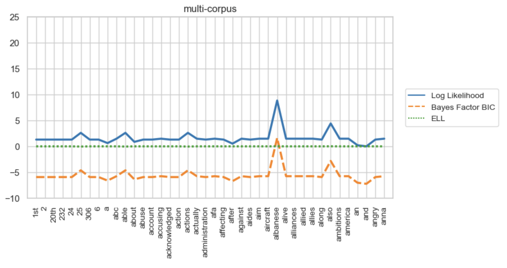
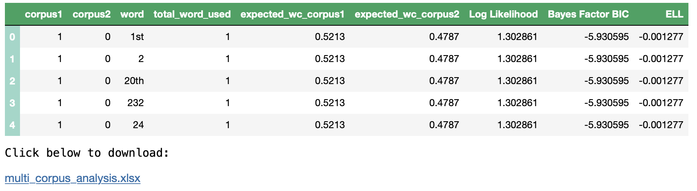
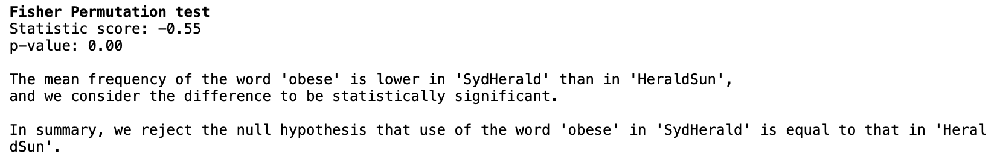
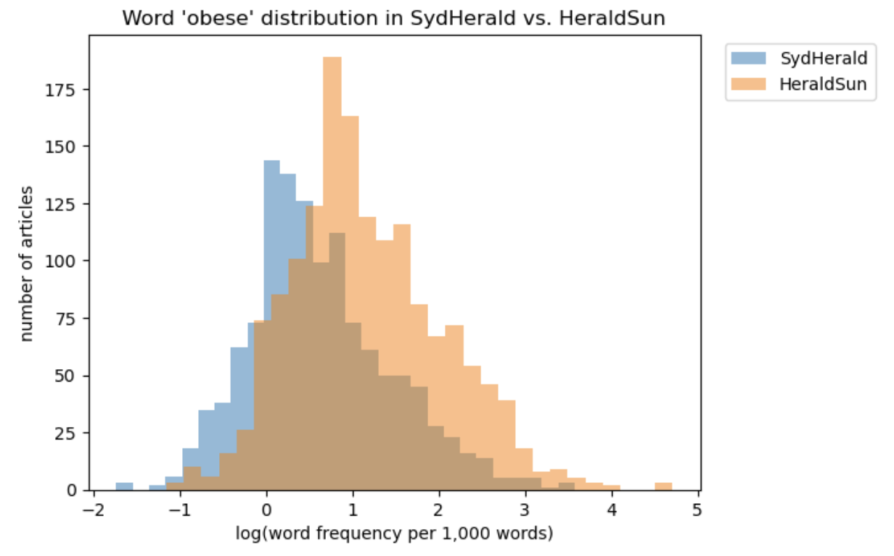

# Keyword Analysis

<b>Abstract:</b> in this notebook, you will use the KeywordAnalysis tool to analyse words in a collection of corpus and identify whether certain words are over or under-represented in a particular corpus compared to their representation in other corpus.  

## Setup
This tool has been designed for use with minimal setup from users. You are able to run it in the cloud and any dependencies with other packages will be installed for you automatically. In order to launch and use the tool, you just need to click the below icon.

<b>Note:</b> Please try to use the first link to access the tool via BinderHub (up to 8GB memory). You can use either your AAF, Microsoft or Google credentials to login. 

1. This link is for people with Australian Institute Affiliations (authentication required)  
      

If you are unable to access the tool via the first link above, then use the second link below. This is the free version of Binder, with less CPU and memory capacity (up to 2GB only).  

2. This link is for people without Australian institutional affiliations  
<<..Under maintenance..>>   
  
<b>Note:</b> this may take a few minutes to launch as Binder needs to install the dependencies for the tool.

## Load the data
<table style='margin-left: 10px'><tr>
<td>  </td>
<td>  </td>
<td>  </td>
<td>  </td>
</tr></table>

This tool will allow you upload text data in a text file (or a number of text files). Alternatively, you can also upload text inside a text column inside your excel spreadsheet 

<b>Note:</b> If you have a large number of text files (more than 10MB in total), we suggest you compress (zip) them and upload the zip file instead. If you need assistance on how to compress your file, please check [the user guide](https://github.com/Sydney-Informatics-Hub/HASS-29_Quotation_Tool/blob/main/documents/jupyter-notebook-guide.pdf).  

## Calculate Word Statistics
Once your texts have been uploaded, you can begin to calculate the statistics for the words in the corpus. You can then visualise the statistics on the charts (as shown below).  

  

You also have the option to save your analysis onto an excel spreadsheet and download it to your local computer.  

  

## Welch t-test & Fisher permutation test
Lastly, you can use statistical tests to investigate if the use of a certain word in a corpus is statistically different to the use of that same word in a different corpus.    

  

You also have the option to plot the word frequency distribution on a histogram, as shown below.  

  

## Reference
The statistical calculations used in this tool are python implementation of the statistical calculation on this [website](https://ucrel.lancs.ac.uk/llwizard.html).

