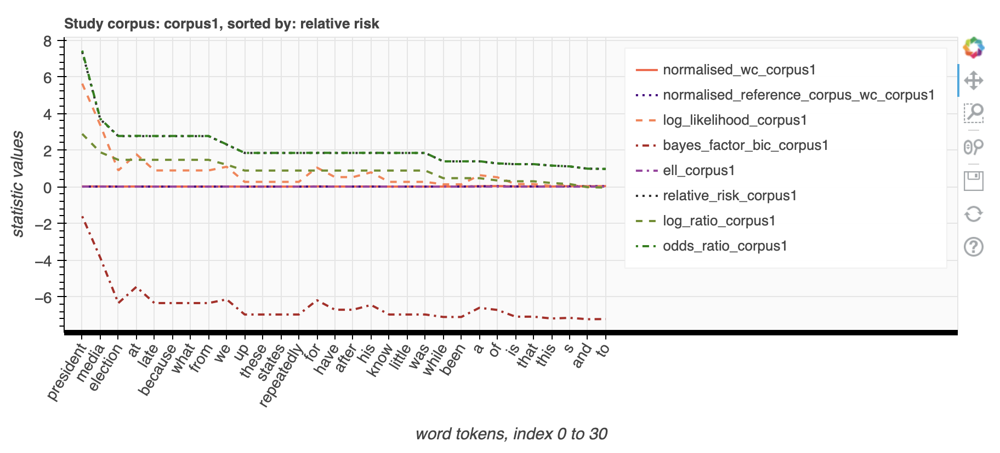
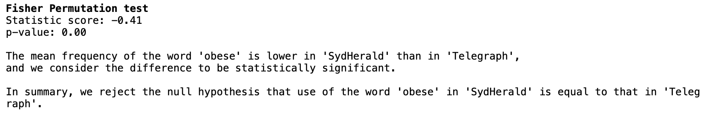
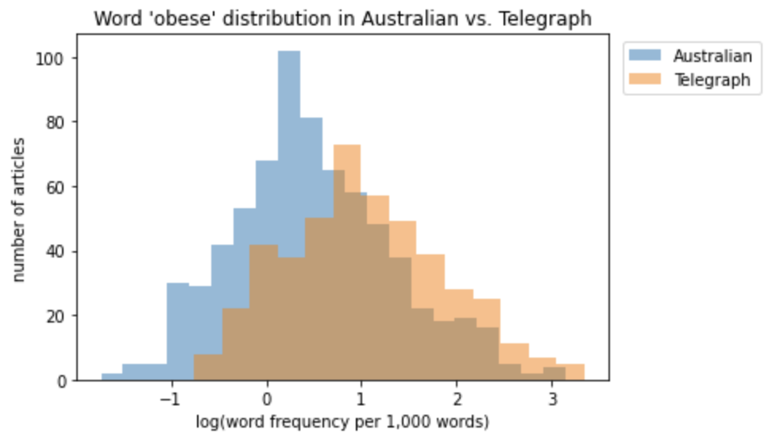

# Keywords Analysis

<b>Abstract:</b> in this notebook, you will use the KeywordsAnalysis tool to analyse words in a collection of corpus and identify whether certain words are over or under-represented in a particular corpus compared to their representation in other corpus.  

## Setup
This tool has been designed for use with minimal setup from users. You are able to run it in the cloud and any dependencies with other packages will be installed for you automatically. In order to launch and use the tool, you just need to click the below icon.

      

<b>Note:</b> CILogon authentication is required. You can use your institutional, Google or Microsoft account to login.  

If you do not have access to any of the above accounts, you can use the below link to access the tool (this is a free Binder version, limited to 2GB memory only).   

It may take a few minutes for Binder to launch the notebook and install the dependencies for the tool. Please be patient.  

## Load the data
<table style='margin-left: 10px'><tr>
<td>  </td>
<td>  </td>
<td>  </td>
<td>  </td>
</tr></table>

This tool will allow you upload text data in a text file (or a number of text files). Alternatively, you can also upload text inside a text column inside your excel spreadsheet 

<b>Note:</b> If you have a large number of text files (more than 10MB in total), we suggest you compress (zip) them and upload the zip file instead. If you need assistance on how to compress your file, please check [the user guide](https://github.com/Sydney-Informatics-Hub/HASS-29_Quotation_Tool/blob/main/documents/jupyter-notebook-guide.pdf).  

## Calculate Word Statistics
Once your texts have been uploaded, you can begin to calculate the statistics for the words in the corpus. You can then visualise the statistics on the charts (as shown below).  

  

You also have the option to save your analysis onto an excel spreadsheet and download it to your local computer.  

  

## Welch t-test and Fisher permutation test
In this notebook, you can also use statistical tests (Welch t-test or Fisher permutation test) to investigate if the use of a certain word in a corpus is statistically different to the use of that same word in a different corpus.  

  

You can also see the distribution of that word on a histogram to see how often it is used in the corpus.  

   

## Reference
The statistical calculations used in this tool are python implementation of the statistical calculation on this [website](https://ucrel.lancs.ac.uk/llwizard.html).

